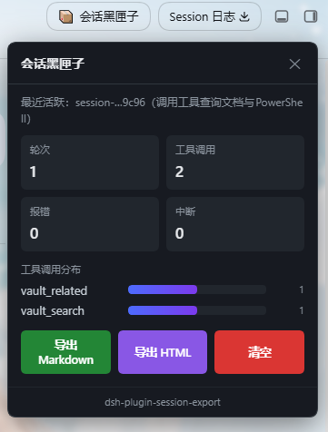
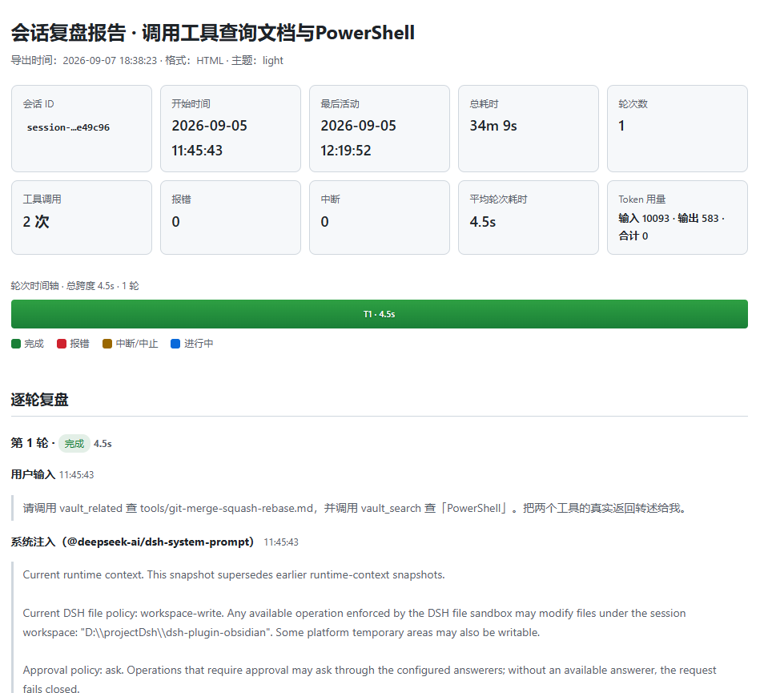

# dsh-plugin-session-export

> DeepSeek Harness 会话黑匣子插件 — 全量旁路采集会话事件，一键导出美化 Markdown / HTML 复盘报告。

[](https://opensource.org/licenses/MIT)
[](https://github.com/deepseek-ai/deepseek-harness)
[](https://nodejs.org/)

插件以**旁路监听**方式采集每一轮对话的用户输入、模型回复、工具调用与报错，不干预 Agent 正常运行。
支持通过自然语言、工具调用或 Web 面板一键导出结构化复盘报告，方便调试 Agent、复盘任务、分享工作流。

## 功能特性

- **全量事件采集** — 订阅 `session/event`，按会话隔离维护事件时间线，覆盖轮次起止、用户输入、模型回复、工具调用/返回、请求报错
- **快照补录** — 插件加载后自动补录加载前已发生的事件，不会漏掉历史对话
- **双格式导出** — Markdown（结构化文本）+ HTML（自包含单文件、内联样式、深浅主题、工具调用可折叠、代码语法高亮、轮次时间轴可视化）
- **实时统计** — 轮次数、工具调用次数/分布、总耗时、平均轮次耗时、最慢工具 Top3、报错/中断数、Token 用量
- **智能截断** — 单条文本超 `maxContentLength` 自动截断并标注，二进制内容只保留元信息
- **敏感脱敏** — 工具入参中 `api_key / token / password / secret / authorization / cookie` 等字段自动掩码
- **Web 面板** — 右上角导航栏按钮，点击展开统计卡片 + 工具分布条形图 + 一键导出/清空
- **配置热更新** — settings 服务 `applies: "live"`，改动即时生效，无需重启

## Demo

### Web 面板

右上角导航栏「会话黑匣子」按钮，点击展开实时统计面板：



### HTML 复盘报告

导出的 HTML 报告包含概览卡片、轮次时间轴、逐轮复盘、工具统计与报错汇总：



## 安装

### 前置条件

- DeepSeek Harness（`dsh`）已安装并可运行
- Node.js >= 18

### 步骤

1. **获取插件**

```bash
git clone https://github.com/zhaoxuejie/dsh-plugin-session-export.git
```

2. **在 dsh profile 中注册**

编辑你的 dsh profile 的 `package.json`（通常位于 `~/.dsh/profiles/<profile-name>/package.json`），
在 `dependencies` 中添加本地 link 依赖，并在 `dsh.profile.bundles` 中注册：

```json
{
  "dependencies": {
    "dsh-plugin-session-export": "link:/path/to/dsh-plugin-session-export"
  },
  "dsh": {
    "profile": {
      "bundles": ["dsh-plugin-session-export"]
    }
  }
}
```

3. **安装依赖**

```bash
cd ~/.dsh/profiles/<profile-name>
pnpm install
```

4. **重启 dsh**

```bash
dsh web   # 或你使用的启动方式
```

启动后右上角导航栏应出现「会话黑匣子」按钮。

## 使用

### 自然语言

直接对模型说：

- 「导出当前会话」
- 「生成复盘报告」
- 「会话统计」
- 「清空会话记录」

### 工具调用

| 工具 | 参数 | 说明 |
|---|---|---|
| `export_session` | `session?`（会话 ID，缺省最近活跃）、`format?`（`markdown` / `html` / `both`） | 导出当前会话复盘报告 |
| `session_stats` | `session?`（缺省返回全部会话概览） | 获取会话统计数据 |
| `session_clear` | `session?`（缺省清空全部） | 清空会话记录 |

### Web 面板

点击右上角「会话黑匣子」按钮，面板展示：

- 实时统计卡片（轮次、工具调用、报错、中断）
- 工具调用次数分布条形图
- 【导出 Markdown】【导出 HTML】【清空】按钮

## 配置项

在 dsh 设置面板中可调整以下配置（热更新，即时生效）：

| 配置 | 类型 | 默认 | 说明 |
|---|---|---|---|
| `enable` | boolean | `true` | 插件总开关 |
| `autoRecord` | boolean | `true` | 自动旁路采集 |
| `maxContentLength` | number | `2000` | 单条文本导出最大字符数（200–100000） |
| `includeToolArgs` | boolean | `true` | 是否保留工具入参（关闭可保护敏感信息） |
| `includeReasoning` | boolean | `true` | 是否包含模型思考过程 |
| `exportFormat` | `markdown` \| `html` \| `both` | `markdown` | 工具缺省导出格式 |
| `htmlTheme` | `light` \| `dark` \| `auto` | `light` | HTML 报告配色主题 |
| `maxEventsPerSession` | number | `500` | 单会话事件上限（50–100000），超出停止记录 |

## 报告结构

1. **会话概览** — 会话 ID、起止时间、总耗时、轮次、工具调用、报错、中断、平均轮次耗时、Token 用量
2. **轮次时间轴** — 横向可视化每轮耗时与状态（完成/报错/中断/进行中）
3. **逐轮复盘** — 用户输入 → 工具调用链（可折叠）→ 模型回复 → 轮次结束状态与耗时
4. **工具调用统计** — 工具名 / 调用次数 / 平均耗时 / 最长耗时
5. **报错汇总** — 时间 / 轮次 / 类型 / 错误消息
6. **原始事件流** — 完整采集时间线（文本按配置截断）

示例报告：[Markdown](docs/sample-report.md) · [HTML](docs/sample-report.html)

## 开发

```bash
# 安装依赖
npm install

# 运行测试（20 项自检）
npm test

# 生成示例报告
node docs/_gen-sample.mjs
```

### 目录结构

```
dsh-plugin-session-export/
├── cordis.patch.yml        # bundle patch 挂载声明
├── package.json            # 包定义 + dsh.client 声明
├── src/
│   ├── index.mjs           # 插件入口：事件订阅 / 工具注册 / Web 路由 / settings
│   ├── config.mjs          # 配置 schema + resolveConfig
│   ├── recorder.mjs        # 会话采集器：归一化 / 配对 / 统计 / 截断 / 快照补录
│   ├── stats.mjs           # 统计计算（纯函数）
│   ├── exporter-markdown.mjs
│   ├── exporter-html.mjs   # HTML 报告（代码高亮 + 时间轴）
│   ├── types.mjs           # 共享常量与工具函数
│   └── client.js           # Web 面板（零依赖浏览器 bundle）
├── assets/                 # README 配图
├── docs/                   # PRD、API 文档、示例报告
├── test/run-all.mjs        # 自检测试
├── CHANGELOG.md
└── LICENSE                 # MIT
```

## License

MIT
